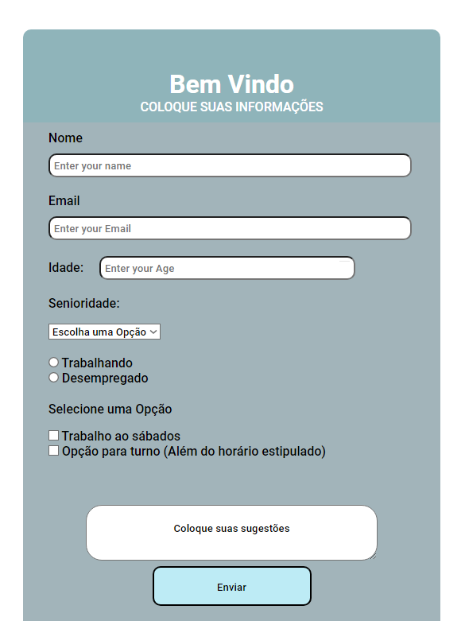

# Formulario

Criado com o intuito de praticar a formatação de codigos com CSS e HTML !

Este codigo foi desenvolvido apenas para estudo de como programar em HTML e CSS!

- [x] Formatação do BG.
- [x] anexação de informações pessoais
- [x] Incersão de link's.
- [ ] Inplementação em um servidor.
- [ ] Testes de funcionalidade no servidor.

## 💻 Pré-requisitos

BG com campos para coleta de informações pessoais de futuros desenvolvedores !
<!---Estes são apenas requisitos de exemplo. Adicionar, informar e posteriormente catalogar as informações!--->
* As informações coletadas serão posteriormente tratadas em Bancos de Dados.

## 🚀 Vem ser Web!

## 🤝 Colaboradores

Projeto Criado e desenvolvido por:

<table>
  <tr>
    <td align="center">
      <a href="#">
         
        
          <b>Rafael Martins</b>
        
      </a>
    </td>
    
  </tr>
</table>

[⬆ Voltar ao topo](#loguin-yoga) 
